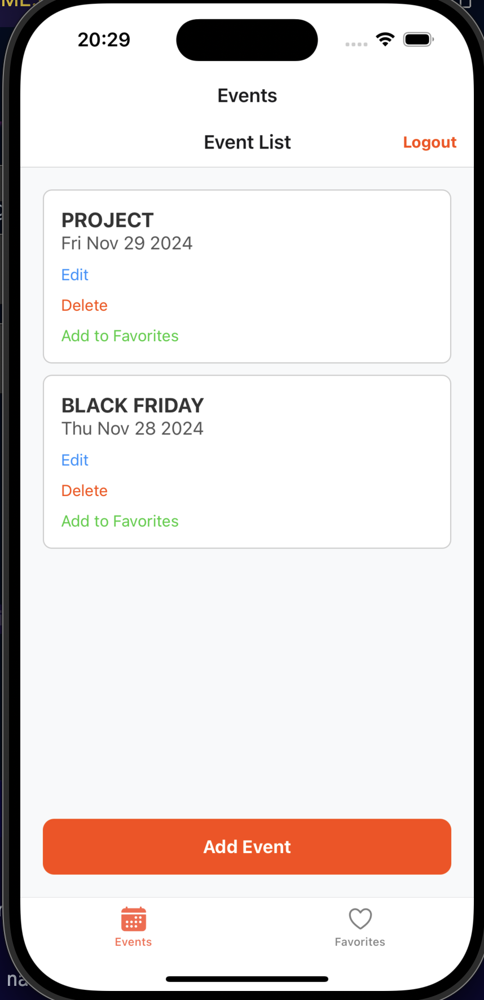
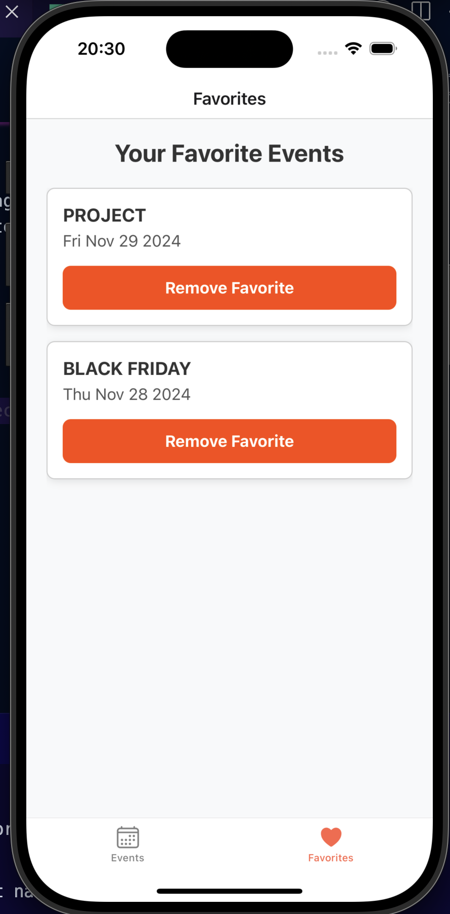
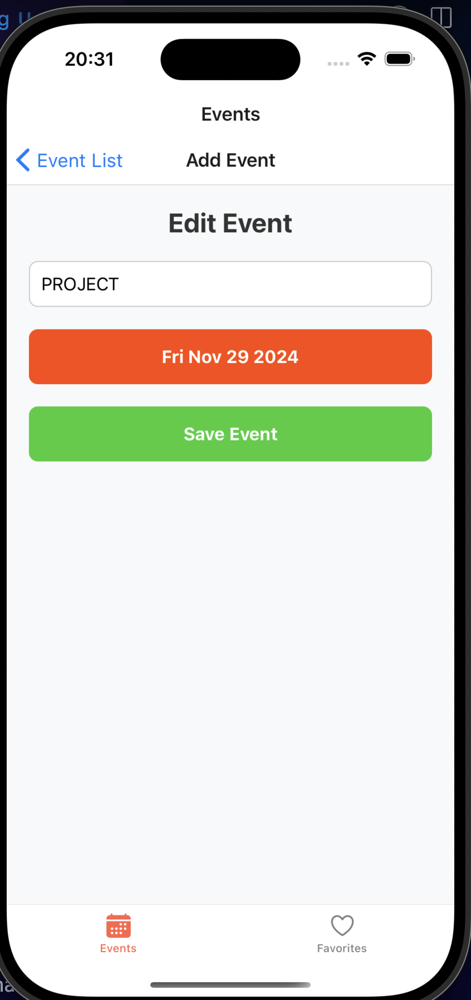
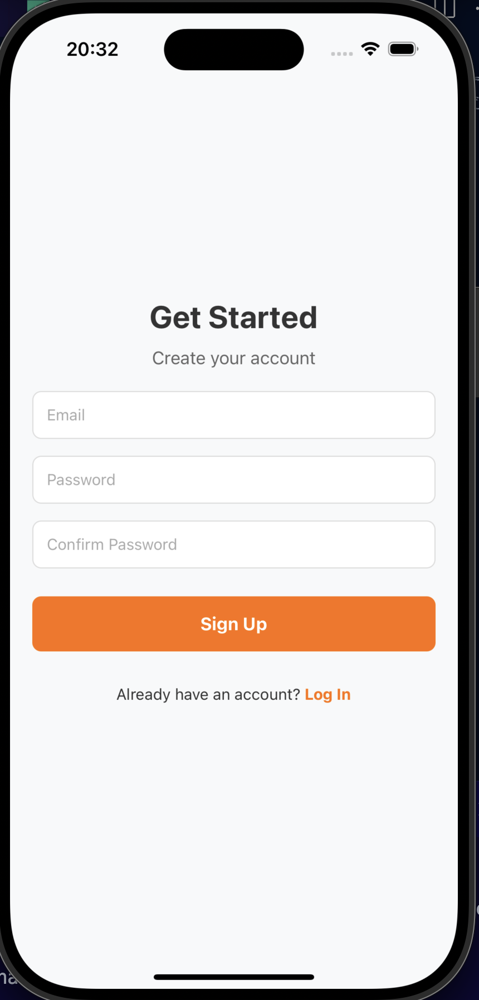

# 📅 Event Organizer App  

A sleek and intuitive event management app built with React Native. This app allows users to create, manage, and explore events while keeping track of their favorites. With a clean and modern UI, the Event Organizer App provides a seamless experience for organizing events.  

---

## ✨ Features  

### 📌 Event Management  
- **Event List:** Browse through a list of upcoming events with details including title and date.  
- **Add/Edit Events:** Create new events or edit existing ones with a simple and intuitive form.  

### ❤️ Favorite Events  
- **Save as Favorite:** Easily add events to your favorite list for quick access later.  
- **Favorite Events List:** View and manage your favorite events, with the ability to remove them when no longer needed.  

### 🔒 Authentication  
- **Sign Up & Log In:** Securely create an account or log in using Firebase Authentication.  
- **User-Specific Data:** Events and favorite lists are unique to each user.  

### 🌈 Modern UI/UX  
- **Dark & Clean Interface:** Beautiful and minimalistic design with user-friendly navigation.  
- **Responsive Design:** Optimized for both iOS and Android devices.  

---

## 🛠️ Technologies Used  

- **React Native:** A JavaScript framework for building native mobile apps.  
- **Expo:** A platform for developing and deploying React Native applications.  
- **React Navigation:** Smooth stack and tab-based navigation between screens.  
- **Firebase Authentication:** Secure user authentication.  
- **Firebase Firestore:** Cloud-based NoSQL database for real-time event data storage.  
- **Custom Styling:** Tailored for a modern, clean, and visually appealing user interface.  

---

## 📸 Screenshots  

- **Event List Screen**: Explore and manage events.  

- **Favorite Events Screen**: View and organize favorite events. 
 
- **Add/Edit Event Screen**: Add or edit events effortlessly.  

- **Authentication Screens**: Sign up or log in with an intuitive interface. 
 

---

## 🚀 Getting Started  

### Prerequisites  
- **Node.js:** Recommended version >= 16.0.  
- **npm or Yarn:** Node package managers.  
- **Expo CLI:** Install globally using the command:  
  ```bash  
  npm install -g expo-cli  
  ```  

### Firebase Setup  
1. Go to the [Firebase Console](https://console.firebase.google.com) and create a new project.  
2. Add a Web app to your Firebase project and copy the configuration details.  
3. Replace the `firebaseConfig` in your `firebaseConfig.js` file with your Firebase details:  

```javascript  
// firebaseConfig.js  
import { initializeApp } from "firebase/app";  
import { getAuth } from "firebase/auth";  
import { getFirestore } from "firebase/firestore";  

const firebaseConfig = {  
  apiKey: "YOUR_API_KEY",  
  authDomain: "YOUR_AUTH_DOMAIN",  
  projectId: "YOUR_PROJECT_ID",  
  storageBucket: "YOUR_STORAGE_BUCKET",  
  messagingSenderId: "YOUR_MESSAGING_SENDER_ID",  
  appId: "YOUR_APP_ID",  
};  

const app = initializeApp(firebaseConfig);  
export const auth = getAuth(app);  
export const firestore = getFirestore(app);  
```  

4. Set up Firestore in the Firebase Console:  
   - Create the database with appropriate security rules.  
   - Add two collections: `events` and `users`.  

---

## 💻 Installation  

### Clone the Repository:  
```bash  
git clone https://github.com/Qusai007/EventOrganizerApp.git  
cd EventOrganizerApp  
```  

### Install Dependencies:  
```bash  
npm install  
# or  
yarn install  
```  

### Running the App:  
1. Start the Expo development server:  
   ```bash  
   npx expo start  
   ```  
2. Scan the QR code with the Expo Go app to run on a physical device.  
3. Alternatively, use an emulator or simulator for Android/iOS through Expo Developer Tools.  

---

## 📂 Project Structure  

```plaintext  
.  
├── assets                  # Images and media files  
├── navigation              # Navigation setup (TabNavigator, StackNavigator)  
├── screens                 # Screen components (EventListScreen, AddEditEventScreen, etc.)  
├── firebaseConfig.js       # Firebase configuration and initialization  
├── App.js                  # Main application entry point  
├── package.json            # Dependencies and project scripts  
└── README.md               # Project documentation  
```  

---

## 🤝 Contributing  

Contributions are welcome! Follow these steps to contribute:  
1. Fork the repository.  
2. Create a new branch (`feature-name`).  
3. Commit your changes:  
   ```bash  
   git commit -m "Add some feature"  
   ```  
4. Push to the branch:  
   ```bash  
   git push origin feature-name  
   ```  
5. Open a pull request.  

---

## 📄 License  

This project is licensed under the MIT License.  

---

## 💬 Connect  

- **GitHub:** [@Qusai007](https://github.com/Qusai007)  
- **LinkedIn:** [Qusai Johar](https://www.linkedin.com/in/qusai-johar)  

Feel free to share your feedback, report bugs, or suggest features!  

---

## 🚀 Quick Commands  

| Task                   | Command                     |  
|------------------------|-----------------------------|  
| Clone Repository       | `git clone <repo-url>`      |  
| Install Dependencies   | `npm install` or `yarn`    |  
| Start Development Server | `expo start`              |  

---
